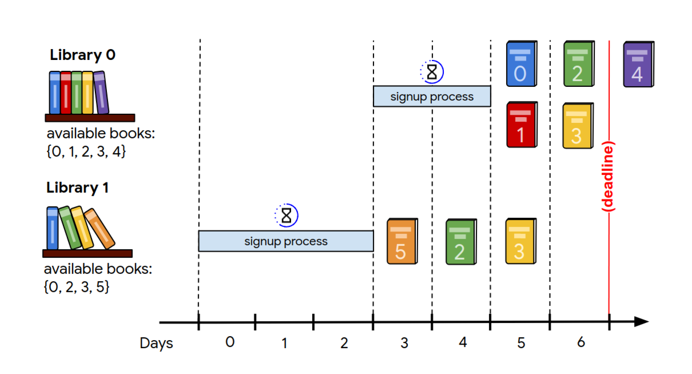

# \# Hash Code 2020 Online Qualification Round

Solutions and code for the Online Qualification Round of [Hash Code 2020](https://codingcompetitions.withgoogle.com/hashcode) **"Book Scanning"**.  
The problem statement can be found [here](hashcode_2020_online_qualification_round.pdf).

#### Introduction

> Books allow us to discover fantasy worlds and be er understand the world we live in.
  They enable us to learn about everything from photography to compilers ... and of
  course a good book is a great way to relax!
  Google Books is a project that embraces the value books bring to our daily lives.
  It aspires to bring the world's books online and make them accessible to everyone. In the
  last 15 years, Google Books has collected digital copies of 40 million books in more
  than 400 languages, partly by scanning books from libraries and publishers all around
  the world.
  In this competition problem, we will explore the challenges of setting up a scanning
  process for millions of books stored in libraries around the world and having them
  scanned at a scanning facility.
>
> _from [Problem statement for the Online Qualification Round of Hash Code 2020](hashcode_2020_online_qualification_round.pdf)_

#### Task

> Given a description of libraries and books available, plan which books to scan from
  which library to maximize the total score of all scanned books, taking into account that
  each library needs to be signed up before it can ship books.
>
> _from [Problem statement for the Online Qualification Round of Hash Code 2020](hashcode_2020_online_qualification_round.pdf)_

#### Input

The input files can be found in `input/`

- [A - example](input/a.txt)  
    Books: `6` Libraries: `2` Time: `7`
- [B - read on](input/b.txt)  
    Books: `100,000` Libraries: `100` Time: `1,000`
- [C - incunabula](input/c.txt)  
    Books: `100,000` Libraries: `10,000` Time: `100,000`
- [D - tough choices](input/d.txt)  
    Books: `78,600` Libraries: `30,000` Time: `30,001`
- [E - so many books](input/e.txt)  
    Books: `100,000` Libraries: `1,000` Time: `200`  
- [F - libraries of the world](input/f.txt)  
    Books: `100,000` Libraries: `1,000` Time: `700`

#### Scoring

tba

## Algorithm

tba  

## Scores

Overall **26,644,116** points (681. place).

#### A – example

Our submission scored **21** points.

The library signup has been completed for **2 out of 2** libraries (100.00%).
The last library signup process ended on day **4** of 7 days.
Library signup took **2.50** days on average.

A total of **6** books have been scanned.
**6** of those books were distinct with an average score of **3.50**.
This is **100.00%** of the 6 books available across all libraries.
The minimum score of a scanned book was **1** and the maximum score of a scanned book was **6**.

#### B – read on

Our submission scored **5,822,900** points.

The library signup has been completed for **90 out of 100** libraries (90.00%).
The last library signup process ended on day **980** of 1000 days.
Library signup took **10.90** days on average.

A total of **58,229** books have been scanned.
**58,229** of those books were distinct with an average score of **100.00**.
This is **58.23%** of the 100,000 books available across all libraries.
The minimum score of a scanned book was **100** and the maximum score of a scanned book was **100**.

#### C – incunabula

Our submission scored **5,645,747** points.

The library signup has been completed for **1298 out of 10,000** libraries (12.98%).
The last library signup process ended on day **99,981** of 100,000 days.
Library signup took **77.03** days on average.

A total of **18,379** books have been scanned.
**18,379** of those books were distinct with an average score of **307.18**.
This is **18.38%** of the 100,000 books available across all libraries.
The minimum score of a scanned book was **1** and the maximum score of a scanned book was **600**.

#### D – tough choices

Our submission scored **4,836,325** points.

The library signup has been completed for **15,000 out of 30,000** libraries (50.00%).
The last library signup process ended on day **29,999** of 30001 days.
Library signup took **2.00** days on average.

A total of **74,405** books have been scanned.
**74,405** of those books were distinct with an average score of **65.00**.
This is **94.66%** of the 78,600 books available across all libraries.
The minimum score of a scanned book was **65** and the maximum score of a scanned book was **65**.

####  E – so many books

Our submission scored **5,142,363** points.

The library signup has been completed for **137 out of 1,000** libraries (13.70%).
The last library signup process ended on day **197** of 200 days.
Library signup took **1.45** days on average.

A total of **28,445** books have been scanned.
**28,445** of those books were distinct with an average score of **180.78**.
This is **28.45%** of the 100,000 books available across all libraries.
The minimum score of a scanned book was **39** and the maximum score of a scanned book was **250**.

#### F – libraries of the world

Our submission scored **5,196,760** points.

The library signup has been completed for **17 out of 1,000** libraries (1.70%).
The last library signup process ended on day **695** of 700 days.
Library signup took **40.94** days on average.

A total of **12,535** books have been scanned.
**12,535** of those books were distinct with an average score of **414.58**.
This is **12.54%** of the 100,000 books available across all libraries.
The minimum score of a scanned book was **1** and the maximum score of a scanned book was **800**.
